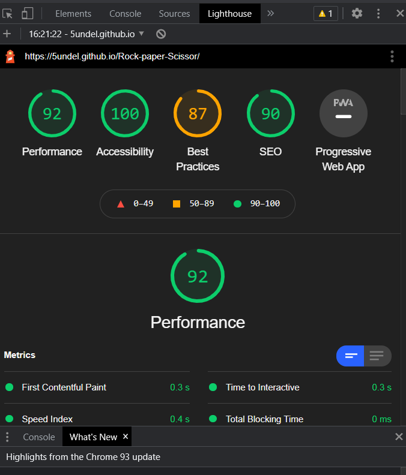

# Rock Paper Scissor 
This website has been created for those looking to play the timeless classic game of rock, paper, scissors. The game is a pure game of chance and is easy to grasp. For those who need further information rules are provided on the index page.

# UX
 - As a first-time user on the page, I want to be able to easily play the game.
 - I want to easily understand the game and rules.

__Features__

 - header
    - Is featured at the top whit the name of the game: Rock Paper Scissor, cleanly and simply.
    - the user can read in the popup window the rules of the game.
    

- popup
    - The popup area of the rules make it easy for the user to see the rules

     

- scoreboard
    - The scoreboard is an easy way to see the scores for the user and computer. The user is on the left side and the computer on the right.
    - The scoreboard has a clean look at the top center whit a good contrast for the text color and the background color. 
    

- Game option
    - The game options are easy to choose from. And when hover over the size change to smaller and the border gets orange to make it easier for the user to see which movie they choose.
    - The winner is shown over the game options with an easy-to-read text that shows if the player is the winner or the computer, or if it is a draw.
    

    - The user can easily restart the game with the restart button.

- Footer
    - In the footer is a link that the user can click to open a new tab to the creator GitHub.

    
 

# DESIGN
- Appearance
  - The site has a clean look with a off-white background color.

- color scheme [link](https://coolors.co/f5f5f5-ffa500-004aad)

  

- Print
  - The font-text is Times New Roman for a clean look and easy to read.

# TEST
- HTML [HTML](https://validator.w3.org/#validate_by_uri)
     - No errors were found when passing through the validator 
    - Three accepted warning where found and will be left not to fix.

- CSS [CSS](https://jigsaw.w3.org/css-validator/#validate_by_uri)
    - No errors were found when passing through the validator 

- Javascript [JavaScript](https://jshint.com/)
    - No errors were found when passing through the validator

- Lighthouse

- Contrast

## Responsiveness & Browser Compatibility

 - Chrome tested in desktop format
  

  - Firefox tested in tablet format
    

  - Edge tested in mobile format
     

# Deployment

This project has been deployed to GitHub Pages.
From the repository, I went to the "Settings" tab and selected "Pages" from the sub-menu.
Once there, I selected the "main" branch from the dropdown, and then clicked the Save button.

 The deployed site can be found [here](https://5undel.github.io/Rock-paper-Scissor/). 
 
 For local deployment, if you would like to make a clone of this repository, you can type the following command in your terminal:
  `git clone https://github.com/5undel/Rock-paper-Scissor`

Alternatively, if you are using Gitpod, you can simply click on the green Gitpod button at the top of the repository, and this will create a new workspace in your Gitpod account.
This [link](https://gitpod.io/#https://github.com/5undel/Rock-paper-Scissor) will do the same thing for you if you do not see the green Gitpod button.

# Credits
    
  - Image for the game is taken from [here](https://dev.to/soniarpit/rock-paper-scissor-in-c-65b)

  - Tutorial for the switch statement [here](https://www.w3schools.com/js/js_switch.asp)

  - Icon to the Github link if from [link](https://www.flaticon.com/search?word=github&style=all&order_by=4&type=icon)

# Wireframe

- desktop

- mobile

